# Peltier Brick Assembly and User Manual

**Project:** Dual Channel Peltier Device  
**Revision:** 2.0  

This README includes the electrical assembly instructions and the user manual for the Dual Channel Peltier Device.

> **Image path note:** This README is written for the following file location:
>
> `Assembly_and_instructions/README.md`
>
> All images should be stored in:
>
> `Assembly_and_instructions/Electrical_assembly_instructions_images/`

---

# Part 1: Electrical Assembly Instructions

## 1. Components

| Component | Image | Description |
|---|---|---|
| TMP36GZ Temperature Sensor | 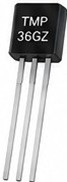 | Analog temperature sensor |
| Motor Driver PCB | 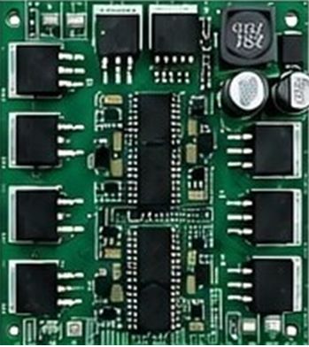 | Main motor driver and power board |
| ESP32-S3 Feather | 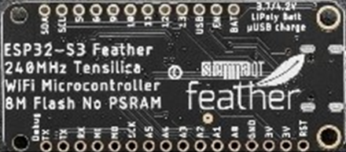 | Microcontroller board |
| DWIN Display 7 inch | 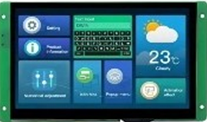 | 7 inch DWIN HMI Display |
| Face Plate | 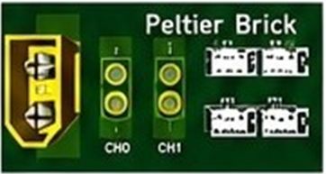 | Panel with connectors and labels |

---

## 2. PCB to ESP32-S3 Connections

| PCB Signal | ESP32-S3 Pin | Description |
|---|---|---|
| 3.3V | 3V3 | ESP 3.3V power |
| GND | GND | Ground |
| B1-H | 5 | High Side B1 |
| B1-L | 6 | Low Side B1 |
| B2-L | 9 | Low Side B2 |
| B2-H | 10 | High Side B2 |
| A1-H | 11 | High Side A1 |
| A1-L | 12 | Low Side A1 |
| A2-L | 13 | Low Side A2 |
| A2-H | 8 / A5 | High Side A2 / Analog |
| 5V | USB | 5V power from USB |

**Tip:** Use short, twisted wires for motor outputs to reduce EMI.

---

## 3. TMP36 Temperature Sensor to ESP32-S3 Connections

| TMP36 Pin | ESP32-S3 Pin | Description |
|---|---|---|
| Pin 1 | VCC / 3V3 | DC voltage input, +2.7 V to 5.5 V |
| Pin 2 | A0 / Analog | Analog voltage output |
| Pin 3 | GND | Ground |

### Important TMP36 Wiring Note

Before connecting the TMP36 sensor to the ESP32:

1. Use a laboratory power supply set between 3 V and 5 V.
2. Set the current limit as low as possible.
3. Temporarily connect the TMP36 to the power supply.
4. Use a multimeter to verify the VCC and GND legs.
5. Confirm correct polarity before connecting the sensor to the ESP32.

**Warning:** Incorrect VCC/GND wiring may damage the sensor or microcontroller.


**Figure:** TMP36GZ temperature sensor reference. Confirm Pin 1 as VCC, Pin 2 as analog output, and Pin 3 as GND before connecting it to the ESP32.

---

## 4. DWIN Display to ESP32 and PCB Connections

| DWIN 7 inch | PCB Signal | ESP32-S3 Pin | Description |
|---|---|---|---|
| 5V | 5V | N.C. | Display power 5V |
| GND | GND | GND | Ground |
| RX2 | N.C. | TX2 | DWIN RX connects to ESP TX2 |
| TX2 | N.C. | RX2 | DWIN TX connects to ESP RX2 |

**Note:** `N.C.` means Not Connected.

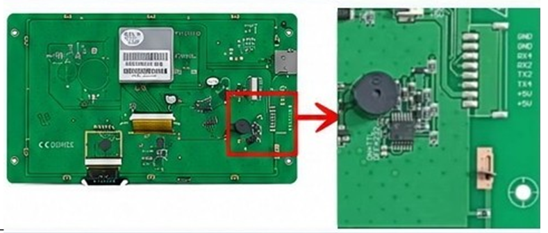

**Figure:** DWIN display connection area and connector pin reference.

---

## 5. PCB to Face Plate Connections

| Face Plate Connection | PCB Connection | Description |
|---|---|---|
| XT60 Input | Power Supply Input | +12 V power input |
| CH0 XT30 | P_CH_A | Peltier Channel 0 |
| CH1 XT30 | P_CH_B | Peltier Channel 1 |

### Connector Notes

- XT60 provides the power supply input, **+12 V**.
- CH0 and CH1 use XT30 connectors for the Peltier brick channels.
- Ensure correct polarity before connecting the Peltier brick.
- RT1, RT2, RT3, and RT4 are for temperature sensor connections.

| Connector | Image | Description |
|---|---|---|
| XT60 Power Input | 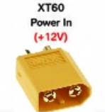 | +12 V power input |
| XT30 Channel 0 | 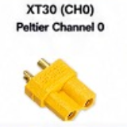 | Peltier Channel 0 |
| XT30 Channel 1 | 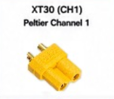 | Peltier Channel 1 |

---

## 6. Additional Recommendations

- Add a main inline fuse, 10–15 A, on the +12 V input.
- Add TVS diode protection on the +12 V input for surge protection.
- Add a bulk capacitor, 470–1000 µF, near the power input.
- Keep high-current motor and Peltier wiring away from signal wires.
- Use cable ties and strain relief to secure all wiring.
- Ensure proper ventilation for heat dissipation.

---

## 7. Final Assembly Notes

Before powering the system:

- Verify all wiring before powering the system.
- Ensure all grounds are shared properly.
- Double-check XT30 and XT60 polarity before applying power.
- Verify TMP36 orientation before connecting power.
- Use insulated wiring and avoid short circuits during assembly.
- Refer to the wiring AWG and ampacity guide to select wires for input power.
- A minimum of 16 AWG wire is recommended for the main power input.

### AWG Current Capacity Guide

| AWG | Maximum Current |
|---|---|
| 14 AWG | 30 A |
| 16 AWG | 20 A |
| 18 AWG | 15 A |
| 20 AWG | 10 A |

---

## 8. Important Warning

**Do not power the Peltier device from a power supply while the ESP32 is connected to a laptop USB port.**

This may damage the laptop USB port.

---

## 9. Wiring Color Guide Recommended

| Color | Signal |
|---|---|
| Red | +12 V input |
| Red | +5 V / +3.3 V |
| Black | GND |
| Blue | Motor outputs A1, A2, B1, B2 |
| Yellow | Peltier outputs CH0, CH1 |
| Green | Signal / UART / I/O |
| Purple | Analog TMP36 |

---

## 10. Tools Required

- Soldering iron
- Multimeter
- Wire stripper / cutter
- Crimping tool
- Heat shrink tubing
- Screwdriver set

---

## 11. Checklist Before Power On

- [ ] All connections are secure and polarity is correct.
- [ ] No loose strands or shorts are on the PCB.
- [ ] TMP36 is wired correctly: Pin 1 to 3V3, Pin 2 to A0, Pin 3 to GND.
- [ ] All grounds are common.
- [ ] Power supply current limit is set.

---

# Part 2: User Manual

## 1. Overview

The Dual Channel Peltier Device allows independent temperature control for two channels using Peltier thermoelectric technology.

Each channel can be set to **Heat** or **Cool** mode with a desired target temperature.

---

## 2. Main Screen Overview

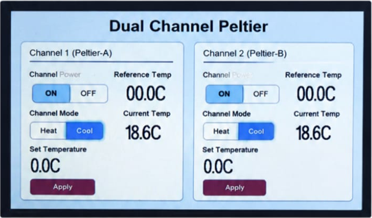

**Figure:** Main screen overview of the Dual Channel Peltier interface.

The main screen contains two independent control panels:

- **Channel 1 (Peltier-A)**
- **Channel 2 (Peltier-B)**

Each channel includes:

- Channel Power control
- Heat / Cool mode selection
- Set Temperature input
- Reference Temperature display
- Current Temperature display
- Apply button

---

## 3. How to Set the Temperature

### Step 1: Tap the Set Temperature Value

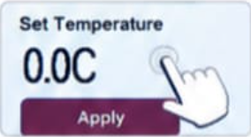

On the main screen, tap the **Set Temperature** value in the channel panel.

This value is located near the bottom-left area of each channel panel.

---

### Step 2: Numeric Keypad Appears

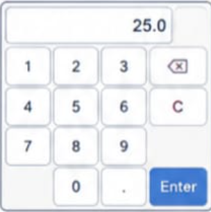

A numeric keypad will appear after tapping the temperature value.

---

### Step 3: Enter the Desired Temperature

Use the keypad to enter the target temperature.

Example:

```txt
25.0
```

---

### Step 4: Tap Enter to Confirm

After entering the desired temperature, tap **Enter** to confirm.

The system will return to the main screen after confirmation.

---

### Step 5: Check the Updated Temperature

The new set temperature will now be displayed on the main screen.

---

## 4. How to Start Heating or Cooling

### Step 1: Choose Heat or Cool Mode

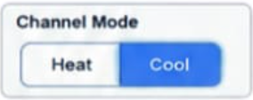

After setting the target temperature, choose the desired channel mode:

- **Heat** — increases the temperature.
- **Cool** — decreases the temperature.

---

### Step 2: Turn On the Channel Power


Turn on the channel by selecting **ON** under **Channel Power**.

Each channel can be controlled independently.

---

### Step 3: Monitor the Current Temperature

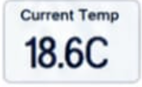

The system will start moving toward the set temperature.

The **Current Temp** value will update in real time.

---

## 5. Basic Operation Summary

1. Select the desired channel.
2. Tap the **Set Temperature** value.
3. Enter the desired temperature using the keypad.
4. Tap **Enter** to confirm.
5. Select **Heat** or **Cool** mode.
6. Turn the channel power **ON**.
7. Monitor the **Current Temp** value.

---

## 6. Operation Notes

- Channel 1 and Channel 2 can operate independently.
- Make sure the Peltier module is connected before starting heating or cooling.
- Do not touch the Peltier surface during operation because it may become hot or cold.
- Verify the temperature sensor connection before powering the system.
- If the displayed temperature does not change, turn off the channel and check the wiring.
- If the system behaves abnormally, turn off the power immediately and inspect all connections.

---

## 7. Quick Troubleshooting

| Problem | Possible Cause | Suggested Check |
|---|---|---|
| Display does not turn on | No 5V power or loose wiring | Check DWIN 5V and GND connections |
| Temperature does not update | TMP36 wiring issue | Check TMP36 Pin 1, Pin 2, and Pin 3 |
| Peltier does not heat or cool | Channel power is OFF or connector is loose | Check ON/OFF switch and XT30 connection |
| Wrong heating/cooling direction | Mode selection or Peltier polarity issue | Check Heat/Cool mode and connector polarity |
| System resets or behaves abnormally | Power supply issue or short circuit | Turn off power and inspect wiring |

## Purchase

Order the display from the following link. Make sure that it is capacitive touch (WTC):

[AliExpress Display Purchase Link](https://www.aliexpress.us/item/3256803193119661.html)