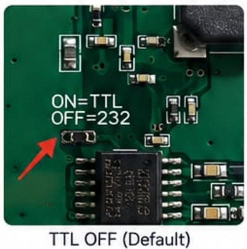
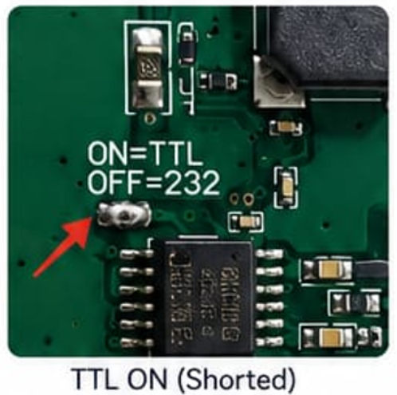
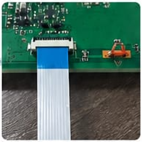
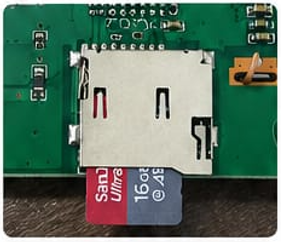
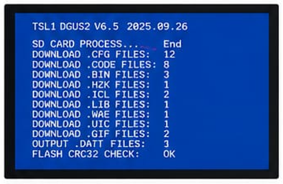
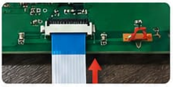
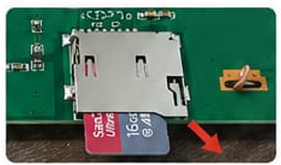
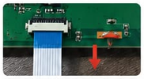
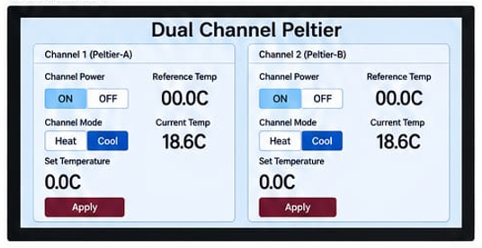
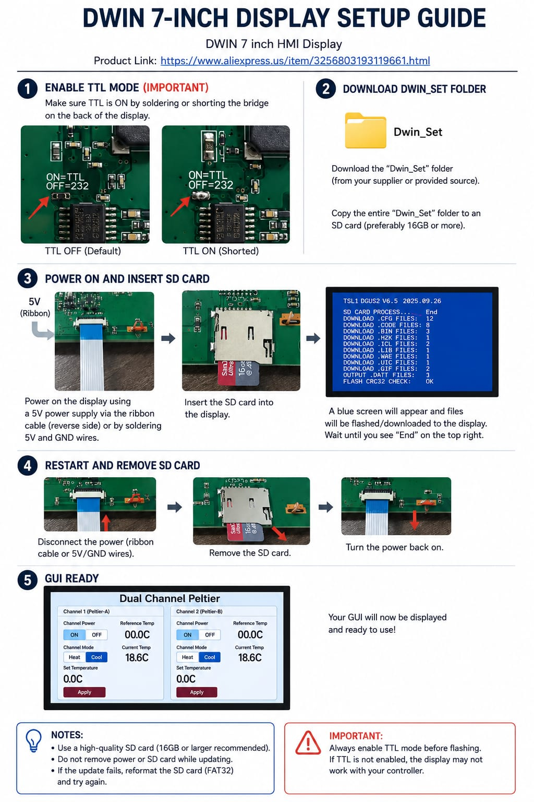

## 1. Enable TTL Mode

Before using the display with the ESP32 or other microcontrollers:

Locate the TTL/232 jumper pads on the back of the display.
Enable **TTL mode** by soldering or shorting the bridge labeled:
- **ON = TTL**
- **OFF = 232**

### TTL OFF Default

**Figure:** TTL mode is OFF by default.

### TTL ON Shorted

**Figure:** Short the bridge to enable TTL mode.

> **Important:** If TTL mode is not enabled, the display may not communicate correctly with the controller.

---

## 2. Prepare the SD Card

Download the Dwin_Set folder provided with your GUI files.
Use a high-quality SD card (16GB or larger recommended).
Format the SD card to FAT32 if needed.
Copy the entire Dwin_Set folder to the root directory of the SD card.
- High-quality SD card preferred

---

## 3. Flash the GUI to the Display

### Step 1: Power the Display

Power the display using:

The ribbon cable power connection, or
5V and GND wires.

### Step 2: Insert the SD Card WHILE the Display is ON

Insert the SD card into the display while the display remains powered ON..

### Step 3: Wait for the Update Screen

( Keep the SD card inside and turn off the display while the Sd card in inside then turn it back on ) A blue update screen will appear. The display will begin downloading and flashing the GUI files.

Wait until the screen shows **End** on the top right.

Do not remove power or remove the SD card during this process.

---

## 4. Restart the Display and Remove the SD Card

### Step 1: Disconnect Power

After the update is complete, disconnect the power from the display.

### Step 2: Remove the SD Card

Remove the SD card from the display.

### Step 3: Power the Display Again

Turn the power back on after removing the SD card.

---

## 5. GUI Ready

After restarting the display, the Dual Channel Peltier GUI should appear.

The display is now ready to use with the Peltier controller.

---

## Basic Setup Summary

1. Enable TTL mode by shorting the TTL bridge.
2. Copy the complete `Dwin_Set` folder to an SD card.
3. Power the display with 5 V.
4. Insert the SD card into the display.
5. turn off the display while SD card is inside then turn it back on 
6. wait untill the blue update screen shows End 
7. disconnect from power and remove SD card 
8. turn the display on and the GUI is ready to Use.
9. Confirm that the GUI appears on the screen.

---

## Notes

- Use a high-quality SD card, preferably 16 GB or larger.
- Format the SD card as FAT32 if the update fails.
- Do not remove power while the display is updating.
- Do not remove the SD card during the update process.
- Always enable TTL mode before connecting the display to the ESP32 controller.
- If the GUI does not appear after restart, repeat the update process with a freshly formatted SD card.

---

## Important Warning

**Always enable TTL mode before flashing or using the display.**

If TTL mode is not enabled, the display may not communicate correctly with the ESP32 controller.

---

  

