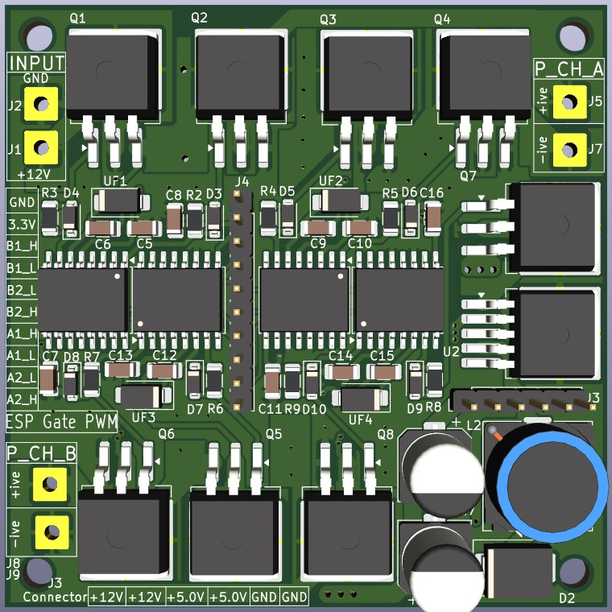
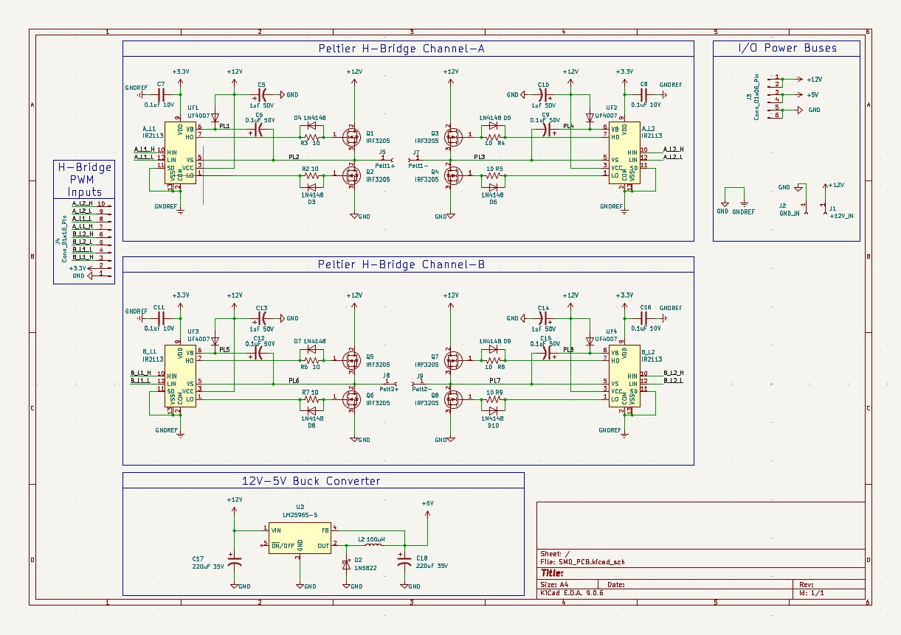

# Peltier Brick Controller

## Description

The Peltier Brick is a modular controller designed to operate two independent Peltier heating and cooling modules. Each channel uses an IR2113 gate driver together with IRF3205 MOSFETs to form a switching stage that allows bidirectional current flow. By reversing the current through the Peltier device, the system can provide both heating and cooling.

A microcontroller generates PWM signals to regulate the power delivered to each Peltier element and control the temperature of each channel independently.

---

## PCB Layout

The images below show the front and back sides of the PCB design.

  
  

## Schematics

The image below shows the circuit schematic for the PCB.

  

---

## Electrical Hardware

KiCad PCB design files and manufacturing outputs:

[Electrical Hardware](Electrical_Hardware/)

---

## GUI

The project also includes a graphical user interface (GUI) for system control and monitoring.

The GUI supports basic interaction with the Peltier system, including control input and display of system status.

[GUI](GUI/)

---

## Datasheets and Design Notes

Power driver discussion and reference documentation:

[DataSheet](DataSheet/)

---

## Assembly and instructions

These are the [Assebly and Instructions](Assembly_and_instructions/)